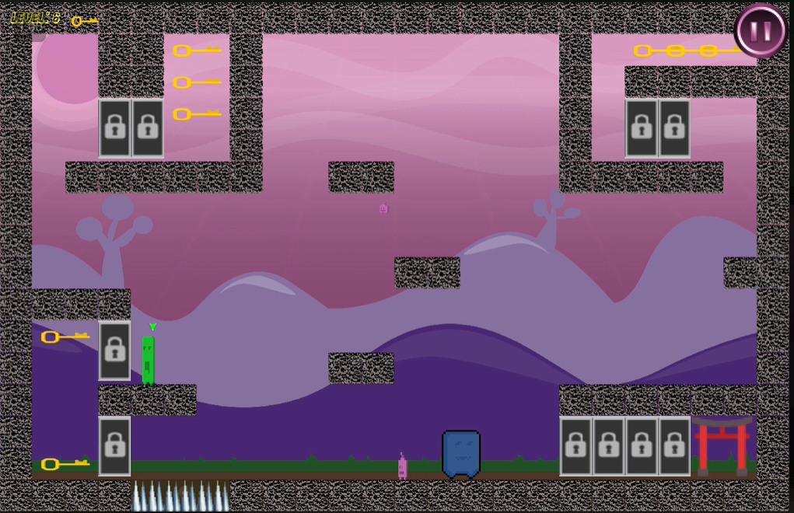

# BOX2D_OOP2_FINAL_PROJECT - Puzzle-Platformer Game

## Programming:
* 
* 
* 

## Description

BOX2D_OOP2_FINAL_PROJECT is a puzzle-platformer game in which you control three characters of different sizes and abilities. Your goal is to guide all the characters to reach the exit successfully by solving challenging puzzles and avoiding obstacles.

## Features

- Three unique characters with different abilities.
- Physics-based gameplay using Box2D.
- Challenging puzzles and obstacles to overcome.
- Intuitive controls for a smooth gaming experience.

## Gameplay Video

[Watch Gameplay Video](https://www.youtube.com/watch?v=uGGU00LBSfI&t=8s)

## Controls

- **Arrow keys:** Move the characters left or right.
- **WASD keys:** Control the characters' jumps (W to jump, A and D for movement).
- **Spacebar:** Swap between the characters to strategize and solve puzzles.

## Requirements

- C++ compiler that supports C++11 or higher.
- SFML library (Simple and Fast Multimedia Library).
- Box2D library (2D physics engine).

## How to Build

1. Install SFML and Box2D libraries on your system.
2. Clone this repository to your local machine.
3. Compile the source files using your C++ compiler and link with SFML and Box2D libraries.
4. Run the executable generated after successful compilation.

## How to Play

- Use the arrow keys or WASD keys to control the characters.
- Press the spacebar to swap between the characters.
- Solve puzzles and avoid obstacles to guide all characters to the exit.
- Enjoy the game!

## Credits

This game was created as a final project for the Object-Oriented Programming 2 course.

## License

This project is licensed under the [MIT License](LICENSE).

